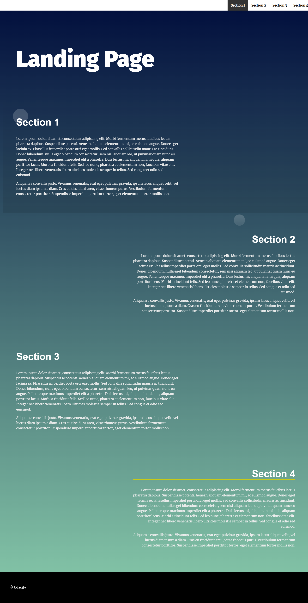

# Landing Page Project

## Project Overview

This project demonstrates how to manipulate the DOM using JavaScript to build a dynamic webpage. It features a dynamically generated navigation menu, smooth scrolling functionality, and section highlighting based on viewport visibility. The project showcases foundational front-end development skills and is part of the **Frontend Developer Nanodegree** from **Udacity**.

## Features

1. **Dynamic Navigation Menu:**

   - The navigation menu is built programmatically based on the sections available in the HTML.
   - New sections added to the HTML are automatically included in the navigation menu.

2. **Smooth Scrolling:**

   - Clicking on a navigation link smoothly scrolls the page to the corresponding section.

3. **Active Section Highlighting:**

   - The section currently visible in the viewport is highlighted, and its corresponding navigation link is styled for visual feedback.

4. **Responsive Navigation:**

   - On smaller screens, the navigation menu transforms into a collapsible hamburger menu for better usability.

5. **Interactive Styles:**
   - Sections are visually enhanced with background circles and animations when active.

## Technologies Used

- **HTML**: For the page structure and semantic layout.
- **CSS**: For styling, including responsive design, animations, and hover effects.
- **JavaScript (ES6)**: For DOM manipulation, event handling, and adding dynamic behavior.

## Screenshot



## Installation and Setup

1. Clone this repository to your local machine:

   ```bash
   git clone https://github.com/THEPEACEMAKER/landing-page
   ```

2. Navigate to the project folder:

   ```bash
   cd landing-page
   ```

3. Open the `index.html` file in your preferred browser:

## Project Structure

```plaintext
├── css/
│   └── styles.css
├── js/
│   └── app.js
├── index.html
└── README.md
```

## How It Works

1. **Dynamic Menu Creation:**

   - JavaScript selects all the `<section>` elements from the DOM and creates corresponding `<li>` elements for the navigation menu.
   - The menu is populated dynamically into the `<ul>` with the ID `navbar__list`.

2. **Smooth Scrolling:**

   - Event listeners on navigation links enable smooth scrolling to the targeted section using `scrollIntoView`.

3. **Active Section Highlighting:**

   - A `scroll` event listener checks which section is in the viewport and applies the `your-active-class` to highlight it.
   - The corresponding navigation link is also given an `active` class.

4. **Responsive Navigation:**
   - A hamburger menu is implemented for screens smaller than 768px. Clicking the toggle button shows or hides the menu.

## Key Learning Outcomes

- Programmatic DOM manipulation.
- Implementing smooth scrolling and scroll-based events.
- Creating responsive layouts with CSS media queries.
- Leveraging ES6 features like `forEach`, `arrow functions`, and template literals.

---

Adel Abdellatif  
GitHub: [THEPEACEMAKER](https://github.com/THEPEACEMAKER)  
LinkedIn: [Adel A. Abdelkader](https://www.linkedin.com/in/adel-a-abdelkader/)
